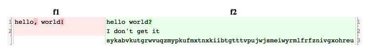

<!-- README.md is generated from README.Rmd. Please edit that file -->

# diffr

<!-- badges: start -->

[](https://github.com/muschellij2/diffr/actions/workflows/R-CMD-check.yaml)
<!-- badges: end -->

The goal of `diffr` is an R package for creating code differences in
JavaScript based on:

<https://github.com/danvk/codediff.js>

[](https://travis-ci.org/muschellij2/diffr)

``` r
library(diffr)
file1 = tempfile()
writeLines("hello, world!\n", con = file1)
file2 = tempfile()
writeLines(paste0(
  "hello world?\nI don't get it\n",
  paste0(sample(letters, 65, replace = TRUE), collapse = "")), con = file2)
```

``` r
diffr(file1, file2, before = "f1", after = "f2")
```


